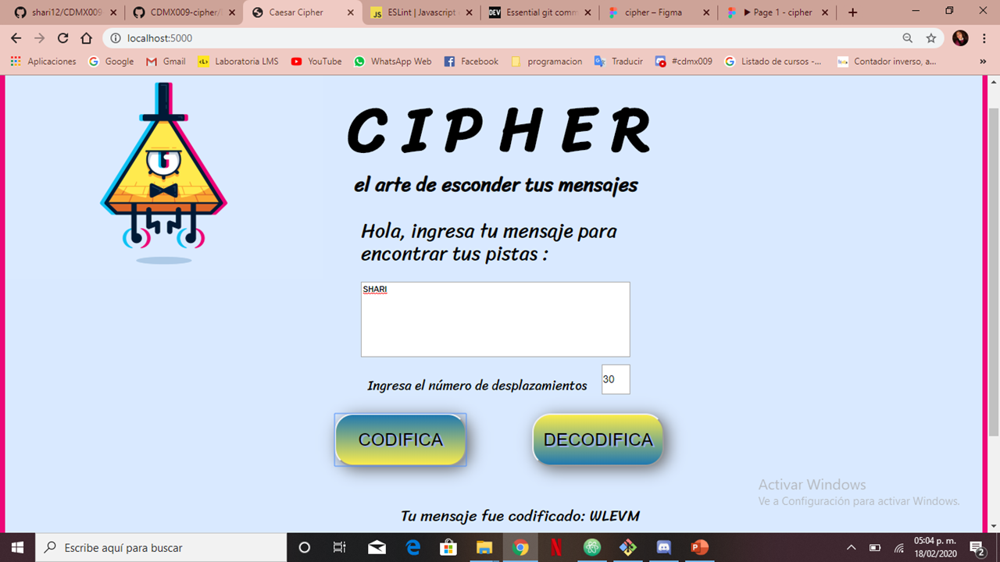
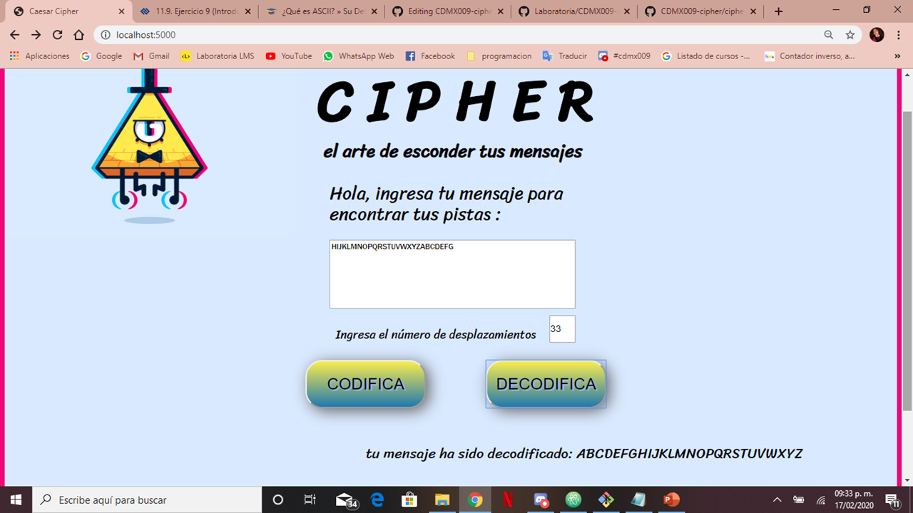
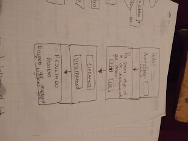
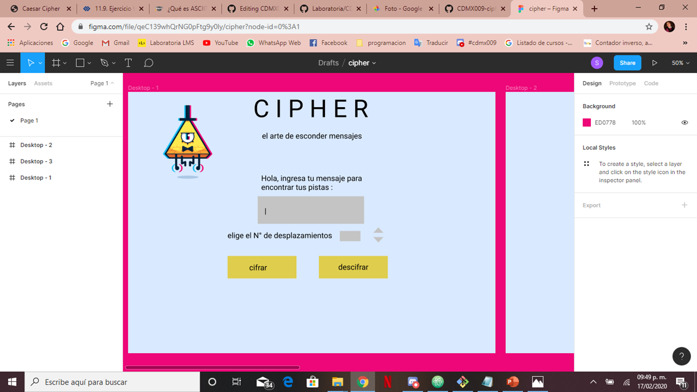

## C I P H E R
### EL ARTE DE ESCONDER MENSAJES

Es creada despues de lanzar un concurso donde podras acceder a un meet & great con alguno de tu artista favorito,
cuando tienes acceso al correo electronico que te enviaron y poder ver las instrucciones (cifradas) del concurso empezaras
a encontrar y a ver las pistas / mensajes despues de descrifrarlas. Unicamente se  puede tener acceso al evento con la clave cifrada.

CIPHER va dirigido para las personas que hayan registrado su correo electronico en el concurso.

Al momento de realizar el sketch se consideraron 4 pantallas, a traves del feedback esto se reducio a una sola pantalla con
2 botones pensando en el usuario hiciera los menos "cliks" posibles

Liga del mockup https://www.figma.com/proto/qeC139whQrNG0pFtg9y0ly/cipher?node-id=0%3A1&scaling=min-zoom

### OBJETIVOS DE APRENDIZAJE

### UX
- [✓] Diseñar la aplicación pensando y entendiendo al usuario.
- [✓] Crear prototipos para obtener feedback e iterar.
- [✓] Aplicar los principios de diseño visual (contraste, alineación, jerarquía).

### HTML y CSS

- [ ] Uso correcto de HTML semántico.
- [✓] Uso de selectores de CSS.
- [ ] Construir tu aplicación respetando el diseño realizado (maquetación).

### DOM

- [✓] Uso de selectores del DOM.
- [✓] Manejo de eventos del DOM.
- [✓] Manipulación dinámica del DOM.

### Javascript

- [✓] Manipulación de strings.
- [✓] Uso de condicionales (if-else | switch).
- [✓] Uso de bucles (for | do-while).
- [ ] Uso de funciones (parámetros | argumentos | valor de retorno).
- [✓] Declaración correcta de variables (const & let).

### Testing
- [ ] Testeo de tus funciones.

### Git y GitHub
- [✓] Comandos de git (add | commit | pull | status | push).
- [✓] Manejo de repositorios de GitHub (clone | fork | gh-pages).

### Buenas prácticas de desarrollo
- [✓] Uso de identificadores descriptivos (Nomenclatura | Semántica).
- [✓] Uso de linter para seguir buenas prácticas (ESLINT).
